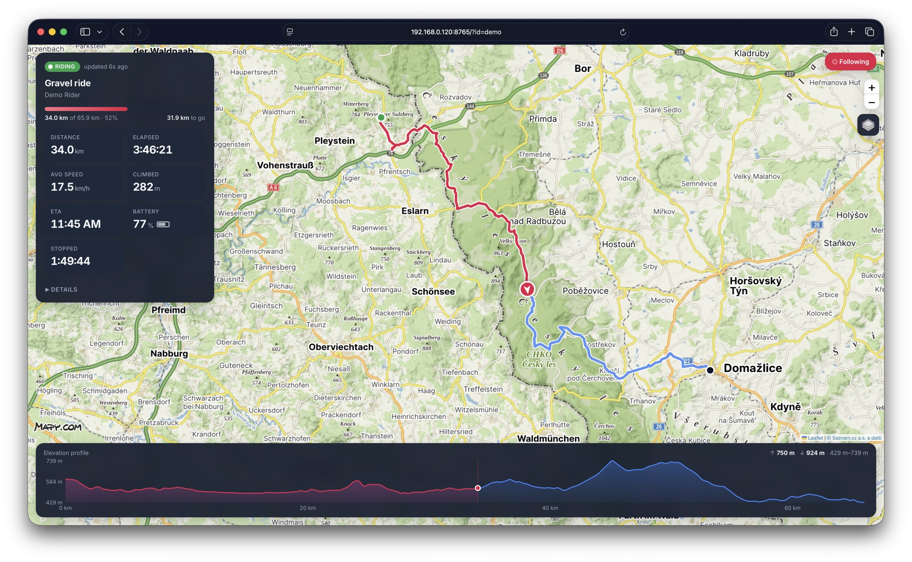
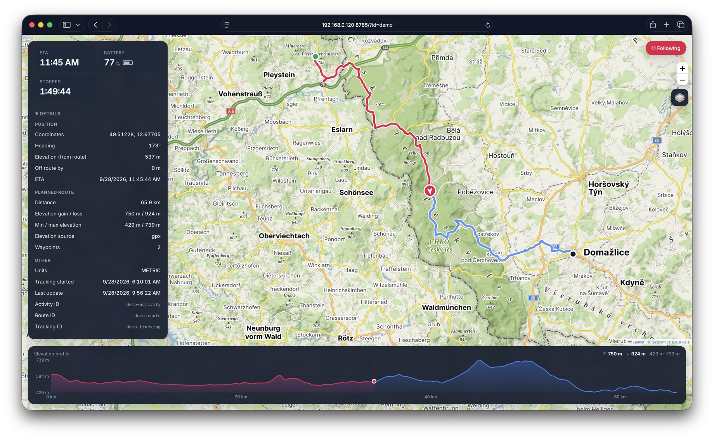
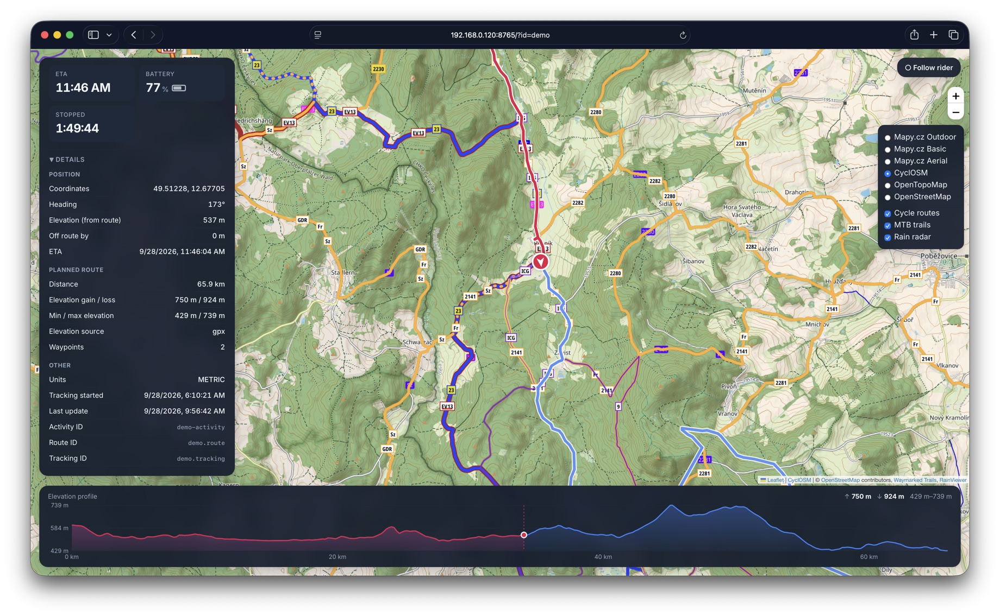

# Karoo Live Tracker

A small web app for following a ride shared from a Hammerhead Karoo bike computer. Paste a Hammerhead live tracking link and it shows the rider on a map with their route, ridden trace, live stats and an elevation profile, updated every few seconds.

**Try it:** https://karoo-live.fly.dev/ (or open the [demo ride](https://karoo-live.fly.dev/?id=demo) directly)



| Ride details | Map layers |
| --- | --- |
|  |  |

This is a proof of concept built on the unofficial endpoint behind Hammerhead's share page. It is not affiliated with Hammerhead or SRAM, and the endpoint may change without notice.

## Features

- Planned route, ridden trace and a rider marker that points in the direction of travel
- Live stats from the Karoo: distance, elapsed and stopped time, average speed, climbing, battery and ETA
- Progress along the route, distance to go and how far the rider is off route
- Elevation profile with the rider's current position
- Base maps: Mapy.cz Outdoor, Basic and Aerial, CyclOSM, OpenTopoMap and OpenStreetMap
- Overlays: signed cycle routes and MTB trails (Waymarked Trails) and rain radar (RainViewer)
- Follow mode that keeps the rider centred in the part of the map not covered by panels
- Keeps showing the last known position if Hammerhead is unreachable (cached on the server and in the browser)
- Works on phones, and follows the system light or dark theme
- A demo ride for trying it out without a live share

## Usage

Open the app and paste a Hammerhead live tracking link, such as `https://dashboard.hammerhead.io/live/AbCd1234`, or just the ID at the end of it. The app then loads `/?id=AbCd1234`, so that URL can be shared directly.

Optional URL parameters:

| Parameter | Example | Meaning |
| --- | --- | --- |
| `id` | `AbCd1234` | Tracking ID to follow, or `demo` for the demo ride |
| `base` | `cyclosm` | Base map: `outdoor`, `basic`, `aerial`, `cyclosm`, `topo`, `osm` |
| `overlays` | `cycling,rain` | Overlays: `cycling`, `mtb`, `rain` |
| `poll` | `5000` | Polling interval in milliseconds (default 10000, 2000 for the demo) |
| `apikey` | | Mapy.cz API key, overriding the server's |

## Running it

The server uses only the Python standard library, so there is nothing to install.

```sh
cp .env.example .env   # then add your Mapy.cz API key
python3 server.py
```

Open http://localhost:8765/.

Or with Docker:

```sh
docker compose up --build
```

### Deploying to Fly.io

[`fly.toml`](fly.toml) runs the same container on a small Fly machine that stops when idle, with a volume for the cache. The tools and commands are set up with [mise](https://mise.jdx.dev):

```sh
mise install              # installs flyctl
mise exec -- fly auth login
mise run setup            # once: creates the app and volume, uploads MAPY_API_KEY from .env
mise run deploy           # every deploy
```

`mise tasks` lists the other shortcuts, such as `dev`, `screenshots` and `logs`.

Pushes to `master` also deploy automatically through [GitHub Actions](.github/workflows/fly-deploy.yml), using the same `mise run deploy`. This needs a `FLY_API_TOKEN` repository secret, which you can create with `fly tokens create deploy`. Changes that only touch docs or screenshots don't trigger a deploy.

### Configuration

Settings are read from the environment or from `.env`:

| Variable | Default | Meaning |
| --- | --- | --- |
| `MAPY_API_KEY` | | Mapy.cz API key, free at [developer.mapy.com](https://developer.mapy.com). Without it the Mapy.cz maps are hidden and CyclOSM is the default. |
| `PORT` | `8765` | Port to listen on |
| `DEMO_SPEED` | `20` | Demo playback speed as a multiple of real time. `0` freezes the demo, which is handy for screenshots. |
| `DEMO_GPX` | `demo/ride.gpx` | GPX file replayed as the demo ride |
| `CACHE_DAYS` | `3` | Days a cached tracking response is kept before it is deleted |

## How it works

The page polls `/api/tracking/<id>`. The Python server forwards this to `https://dashboard.hammerhead.io/v1/shares/tracking/<id>`, because that endpoint doesn't send CORS headers and can't be called from the browser directly. Each good response is also saved to `cache/`, and returned with an `X-Cache: stale` header when Hammerhead fails. Only the page and the API are served; the cache and source files are not publicly reachable. [`response/example.json`](response/example.json) shows the response format.

The tracking ID `demo` never reaches Hammerhead. [`mock.py`](mock.py) replays [`demo/ride.gpx`](demo/ride.gpx), a recorded 66 km gravel ride, using its own timestamps, so real stops show up as paused. It builds a response in the same format and starts halfway through the ride. Point `DEMO_GPX` at any GPX track to replay a different ride.

| File | Purpose |
| --- | --- |
| `index.html` | The whole front end: Leaflet map, panels and elevation chart |
| `server.py` | Static file server, Hammerhead proxy and cache |
| `mock.py` | Demo ride simulation |
| `demo/ride.gpx` | Ride replayed by the demo |
| `response/example.json` | Example API response |

## Privacy

The app has no accounts, cookies or analytics. Tracking data comes from the Hammerhead share link a viewer pastes and passes through the server. The server keeps the latest response for each link, and the browser keeps a copy in local storage, so the map keeps working if Hammerhead is briefly unreachable. Both copies are deleted after `CACHE_DAYS` (3 days by default). The server log records tracking IDs when Hammerhead requests fail. Map tiles are loaded directly from the map providers, which see the viewer's IP address and the map area being viewed.

## Map data

Maps and overlays come from [Mapy.cz](https://mapy.com) (© Seznam.cz), [OpenStreetMap](https://www.openstreetmap.org/copyright) contributors, [CyclOSM](https://www.cyclosm.org), [OpenTopoMap](https://opentopomap.org), [Waymarked Trails](https://waymarkedtrails.org) and [RainViewer](https://www.rainviewer.com). Each has its own terms of use. The free public tile servers are meant for light use.
